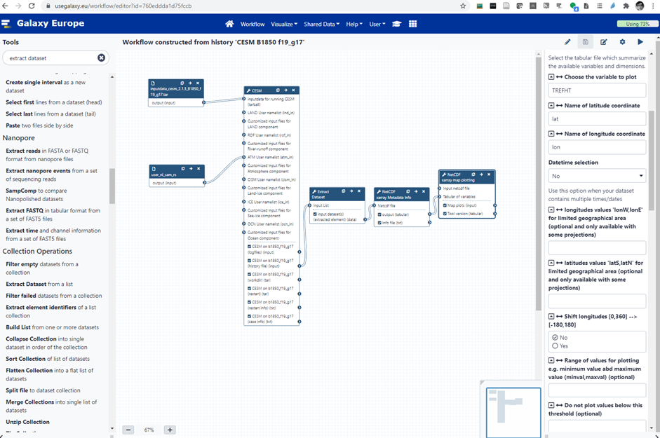

# Roadmap

We plan to leverage the existing collaboration between EOSC-Nordic and EOSC-Life for Tool roadmap (packaging, containerization, etc.) to implement tools and workflows as identified in Annex-A. 
When it comes to data management, we will explore different solutions in collaboration with EOSC-Nordic. The need to streamline data movement (and overall to reduce data copies as much as possible) has been clearly identified (it is currently one major bottleneck for researchers and it definitely hinders their ability to smoothly move to cloud computing, including HPC-cloud). As part of EOSC-Nordic, we have already tested different solutions, for instance converting netCDF model outputs to data formats that are more efficient on cloud resources (zarr, caterva; zarr is compatible with xarray so it would not significantly change researchers’ day to day habits), creating online catalog with intake or SpatioTemporal Asset Catalogs and finally offering remote access (public or private) with s3 and/or s3-compatible object storage (such as minio). 

One major task, in several of the identified workflows, is to run an Earth System Model: CESM, the community Earth System Model developed and maintained by NCAR is already available in Galaxy and NorESM could also be added (a conda package and corresponding container are already available). Below is an example of Galaxy workflow (see Figure-1):

**Figure-1**: Workflow for running a CESM B1850 f18_g17 experiment on Galaxy. This example workflow sets-up the case, compiles the code, runs one month and generates plots (surface temperature). 

While Galaxy is highly configurable and flexible on how to run tools e.g. Galaxy can use different back-end and queuing systems, we have made all our tests on Galaxy Europe where Galaxy tools are run either as conda packages (from conda-forge and/or bioconda) and/or within containers (docker, singularity).
To introduce CESM in Galaxy Europe we have:
- Packaged CESM in bioconda 
- Generated automatically containers
- Created an XML wrapper with metadata (EDAM ontology and Galaxy metadata) so that CESM Galaxy tool can be called from the Galaxy Graphical Interface, command line (from any terminal) or JupyterLab (for instance the Galaxy Climate JupyterLab).

Then whenever a user creates a workflow (or runs the CESM Galaxy tool), he/she can:
- Share his/her history either with everyone or only with his/her collaborators (end-users have full control on permissions/access to data and histories);
- Reference/add his/her Galaxy history to Rohub (https://www.rohub.org/) as a Research Object (public or private);
- Publish his/her workflow in Workflow Hub (https://workflowhub.eu/) as a FAIR workflow.

EC-EARTH is not open source which makes it more difficult to be included in Galaxy. However, EC-EARTH containers (registered in private repositories) will be developed and tested within NICEST2. As a consequence, all workflows in Annex-A where an ESM needs to be run will be demonstrated with NorESM and/or CESM. For any other workflows, we will make use of both NorESM and EC-EARTH model outputs (or more generally any model outputs publicly available from either researchers’ simulations or CMIP6).

# conlcusion and recommendations

We have made an attempt at identifying the needs of the climate community when it comes to Workflow Management Systems. During the NICEST2 project, we will be using Galaxy but make sure that our developed workflows can interoperate with other WMSs (at least as sub-workflows). During the second part of the NICEST2 project, we will implement the workflows we have identified as key for the climate community (see Annex-A) and will work in collaboration with WP3 to ensure the FAIRness of our tools, data and workflows.

In addition, and as a way to prepare for Open Science & FAIR research, we strongly recommend the climate community to:
- Organize regular outreach and onboarding events (training/hackathon/videos) to disseminate the findings and recommendations to the Nordic communities;
- Disseminate information on available training on programming and best software practices (The Carpentries, CodeRefinery, PRACE, etc.);
- Share their “recipes” on how to efficiently run an ESM on a given platform (optimization options, processor layout, file system hints, etc.) so that other scientists can benefit from it;
- Create an account on https://usegalaxy.eu/, look at the available tutorials and begin to familiarize themselves with the tool shed;
- Create an account on RoHub (https://www.rohub.org/) to see what Research Objects can bring for their research lifecycle management, to find informations and other relevant pieces of work, and to expand their interactions both within their community and outside;
- Upload their workflows in WorkflowHub e.g. https://workflowhub.eu/ to increase the FAIRness of their research work and make it more visible in their own community and beyond;
- Report their code changes back to the main repository or at least to the ESM code developers (even if they do not incorporate these directly into the next release, they would get a better pictures of what required modifications and/or can be improved);
- Seriously think about a Data Management Plan which has to be considered as a “live” document and needs updating throughout research work advances;
- Seek advice regarding the most suited platform to do their ESM related work (whether it relates to teaching/training, testing, development, small run, large experiments, etc.) and do not hesitate to try various options since a HPC is not necessarily the most sensible choice; 
- Also investigate alternative storage possibilities, in particular for the long term archiving;
- Consider exploiting containers to run ESMs as they come at no cost in terms of performance and provide a well-defined software environment which they will be able to retrieve on many different platforms, from laptop to cloud and HPC;
- Whenever possible decompose their tasks (data pre-processing, simulations, data extraction, data post-processing, plots, etc.) in “chunks” which can then be made into workflows (or sub-workflows) and reused by their future selves or others;
- Use a Workflow Management System, starting with simple cases (to get a feel about how that works) and progressively increasing complexity, especially for sequences that require a lot of manual interventions and are potential source of errors (data inside a workflow is never mistaken and follows the pre-defined path).

